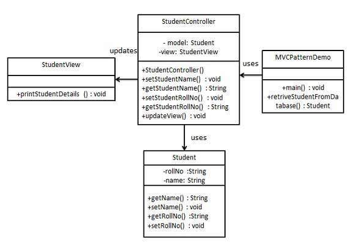

# HW2

### OO Design Patterns      
*References:* http://www.geeksforgeeks.org/singleton-design-pattern/, https://sourcemaking.com/design_patterns, https://www.tutorialspoint.com/design_pattern/factory_pattern.htm      
**1. Creational Patterns:** They are all about class instantiation and are divided into class creation and object creation patterns.  
Examples of Creational Patterns:  
**a) Singleton Pattern:** The singleton pattern is one of the simplest design patterns: it involves only one class which is responsible to instantiate itself, to make sure it creates not more than one instance; in the same time it provides a global point of access to that instance. In this case the same instance can be used from everywhere, being impossible to invoke directly the constructor each time.     The implementation involves a static member in the "Singleton" class, a private constructor and a static public method that returns a reference to the static member.     

*Example:* Here we have declared getInstance() static so that we can call it without instantiating the class. The first time getInstance() is called it creates a new singleton object and after that it just returns the same object. Note that Singleton obj is not created until we need it and call getInstance() method.   
```
// Classical Java implementation of singleton       
// design pattern       
class Singleton
{
    private static Singleton obj;
 
    // private constructor to force use of
    // getInstance() to create Singleton object
    private Singleton() {}
 
    public static Singleton getInstance()
    {
        if (obj==null)
            obj = new Singleton();
        return obj;
    }
}
```
    
**b)  Factory Method Pattern:** It lets a class defer instantiation to subclasses. Define an interface for creating an object, but let subclasses decide which class to instantiate.    
It is useful in scenarios like this: A framework needs to standardize the architectural model for a range of applications, but allow for individual applications to define their own domain objects and provide for their instantiation.     
    
*Example:*      
Step-1: Create an interface (say, Shape)        
Step-2: Create concrete classes implementing the same interface (say, Rectangle, Triangle,Square)       
Step-3: Create a Factory to generate object of concrete class based on given information (say, ShapeFactory)        
Step-4: Use the Factory to get object of concrete class by passing an information such as type      
```
ShapeFactory shapeFactory = new ShapeFactory();

//get an object of Circle and call its draw method.
Shape shape1 = shapeFactory.getShape("CIRCLE");
```     
     
*References:* https://sourcemaking.com/design_patterns, http://www.oodesign.com/proxy-pattern.html, http://www.oodesign.com/decorator-pattern.html          
**2. Structural Design Patterns:** These design patterns are all about class and object composition. Structural class-creation patterns use inheritance to compose interfaces.    
**a) Proxy Design Pattern:** It provides a surrogate or placeholder for another object to control access to it.   
There are four common situations in which the Proxy pattern is applicable:    
* A virtual proxy is a placeholder for "expensive to create" objects. The real object is only created when a client first requests/accesses the object.   
* A remote proxy provides a local representative for an object that resides in a different address space.     
* A protective proxy controls access to a sensitive master object. The "surrogate" object checks that the caller has the access permissions required prior to forwarding the request.   
* A smart proxy interposes additional actions when an object is accessed.   
*Description of its working:* A client obtains a reference to a Proxy, the client then handles the proxy in the same way it handles RealSubject and thus invoking the method doSomething(). At that point the proxy can do different things prior to invoking RealSubject's doSomething() method. The client might create a RealSubject object at that point, perform initialization, check permissions of the client to invoke the method, and then invoke the method on the object. The client can also do additional tasks after invoking the doSomething() method, such as incrementing the number of references to the object.     
    
**b) Decorator Design Pattern:** It provide a flexible alternative to subclassing for extending functionality. It attaches additional responsibilities to an object dynamically.    
When we want to add behavior or state to individual objects at run-time, inheritance is not feasible because it is static and applies to an entire class.   
*Example:* The ornaments that are added to pine or fir trees are examples of Decorators. Lights, garland, candy canes, glass ornaments, etc., can be added to a tree to give it a festive look. The ornaments do not change the tree itself which is recognizable as a Christmas tree regardless of particular ornaments used. As an example of additional functionality, the addition of lights allows one to "light up" a Christmas tree.   
      
*References:* https://sourcemaking.com/design_patterns, http://www.oodesign.com/visitor-pattern.html, http://www.oodesign.com/observer-pattern.html                  
**3. Behavioral Patterns:** They are most specifically concerned with communication between objects.    
**a) Visitor Pattern:** Visitor lets you define a new operation without changing the classes of the elements on which it operates.    
Situation where it is useful: Many distinct and unrelated operations need to be performed on node objects in a heterogeneous aggregate structure. You want to avoid "polluting" the node classes with these operations. And, you don't want to have to query the type of each node and cast the pointer to the correct type before performing the desired operation.    
*Example:*  Customers Application       
We want to create a reporting module in our application to make statistics about a group of customers. The statistics should made very detailed so all the data related to the customer must be parsed. All the entities involved in this hierarchy must accept a visitor so the CustomerGroup, Customer, Order and Item are visitable objects.     
In this example we can see the following actors:
* IVisitor and IVisitable interfaces        
* CustomerGroup, Customer, Order and Item are all visitable classes. A CustomerGroup represents a group of customers, each Customer can have one or more orders and each order can have one ore more Items      
* GeneralReport is a visitor class and implements the IVisitor interface        
    
**b) Observer Pattern:** It is a way to notify a change to number of classes. It defines a one-to-many dependency between objects so that when one object changes state, all its dependents are notified and updated automatically. Procedure followed: Define an object that is the "keeper" of the data model and/or business logic (the Subject). Delegate all "view" functionality to decoupled and distinct Observer objects. Observers register themselves with the Subject as they are created. Whenever the Subject changes, it broadcasts to all registered Observers that it has changed, and each Observer queries the Subject for that subset of the Subject's state that it is responsible for monitoring.   
*Example:* News Agency       
Lets' take the example of a news agency. A news agency gathers news and publish them to different subscribers. We need to create a framework for an agency to be able to inform immediately, when event occurs, its subscribers about the event. The subscribers can receive the news in different ways: Emails, SMS, etc. The solution need to be extensively enough to support new types of subscribers(maybe new communication technologies will appear).        
Obviously, the agency is represented by an Observable(Subject) class named NewsPublisher. This one is created as an abstract class because the agency want to create several types of Observable objects: in the beginning only for business news, but after some time sport and political new will be published. The concrete class is BusinessNewsPublisher.      
The observer logic is implemented in NewsPublisher. It keeps a list of all it subscribers and it informs them about the latest news. The subscribers are represented by some observers (SMSSubscriber, EmailSubscriber). Both the observers mentioned above are inherited from the Subscriber. The subscriber is the abstract class which is known to the publisher. The publisher doesn't know about concrete observers, it knows only about their abstraction.        
In the main class a publisher(Observable) is built and a few subscribers(Observers). The subscribers are subscribed to the publisher and they can be unsubscribed. In this architecture new types of subscribers can be easily added(instant messaging) and new types of publishers(Weather News, Sport News).     

        
        
### Free Style Design Patterns      
*References:* https://www.tutorialspoint.com/design_pattern/mvc_pattern.htm     
**1. MVC Pattern:** It stands for Model-View-Controller Pattern. This pattern is used to separate application's concerns.
* Model - Model represents an object or JAVA POJO carrying data. It can also have logic to update controller if its data changes.       
* View - View represents the visualization of the data that model contains.     
* Controller - Controller acts on both model and view. It controls the data flow into model object and updates the view whenever data changes. It keeps view and model separate.        
*Example:* We can create a Student object acting as a model. StudentView will be a view class which can print student details on console and StudentController is the controller class responsible to store data in Student object and update view StudentView accordingly. Diagramatically,
     
        
 *References:* https://www.tutorialspoint.com/design_pattern/front_controller_pattern.htm              
 **2. Front Controller Pattern:** The front controller design pattern is used to provide a centralized request handling mechanism so that all requests will be handled by a single handler. This handler can do the authentication/ authorization/ logging or tracking of request and then pass the requests to corresponding handlers. Following are the entities of this type of design pattern.      
* Front Controller - Single handler for all kinds of requests coming to the application (either web based/ desktop based).      
* Dispatcher - Front Controller may use a dispatcher object which can dispatch the request to corresponding specific handler.       
* View - Views are the object for which the requests are made.      
        
*Steps involved:*       
Step-1: Create Views        
```
public class HomeView {
   public void show(){
      System.out.println("Displaying Home Page");
   }
}
```     
Step-2: Create Dispatchers      
```
public class Dispatcher {
   private StudentView studentView;
   private HomeView homeView;
   
   public Dispatcher(){
      studentView = new StudentView();
      homeView = new HomeView();
   }

   public void dispatch(String request){
      if(request.equalsIgnoreCase("STUDENT")){
         studentView.show();
      }
      else{
         homeView.show();
      }	
   }
}
```     
Step-3: Create Controllers      
```
public class FrontController {
	
   private Dispatcher dispatcher;

   public FrontController(){
      dispatcher = new Dispatcher();
   }

   private boolean isAuthenticUser(){
      System.out.println("User is authenticated successfully.");
      return true;
   }

   private void trackRequest(String request){
      System.out.println("Page requested: " + request);
   }

   public void dispatchRequest(String request){
      //log each request
      trackRequest(request);
      
      //authenticate the user
      if(isAuthenticUser()){
         dispatcher.dispatch(request);
      }	
   }
}
```     
Step-4: Use the FrontController to demonstrate Front Controller Design Pattern      
```
public class FrontControllerPatternDemo {
   public static void main(String[] args) {
   
      FrontController frontController = new FrontController();
      frontController.dispatchRequest("HOME");
      frontController.dispatchRequest("STUDENT");
   }
}
```		     
        
	
*References:* https://www.tutorialspoint.com/design_pattern/transfer_object_pattern.htm			
**3. Transfer Object Pattern:** The Transfer Object pattern is used when we want to pass data with multiple attributes in one shot from client to server. Transfer object is also known as Value Object. Transfer Object is a simple POJO class having getter/setter methods and is serializable so that it can be transferred over the network. It does not have any behavior. Server Side business class normally fetches data from the database and fills the POJO and send it to the client or pass it by value. For client, transfer object is read-only. Client can create its own transfer object and pass it to server to update values in database in one shot. Following are the entities of this type of design pattern:				
* Business Object - Business Service fills the Transfer Object with data.	
* Transfer Object - Simple POJO having methods to set/get attributes only.	
* Client - Client either requests or sends the Transfer Object to Business Object.	
	
### Selenium Code		
Link to code file:	
[Link](./Selenium/src/test/java/selenium/tests/WebTest.java) to Selenium Test File	
